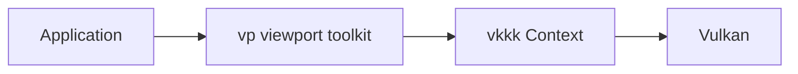
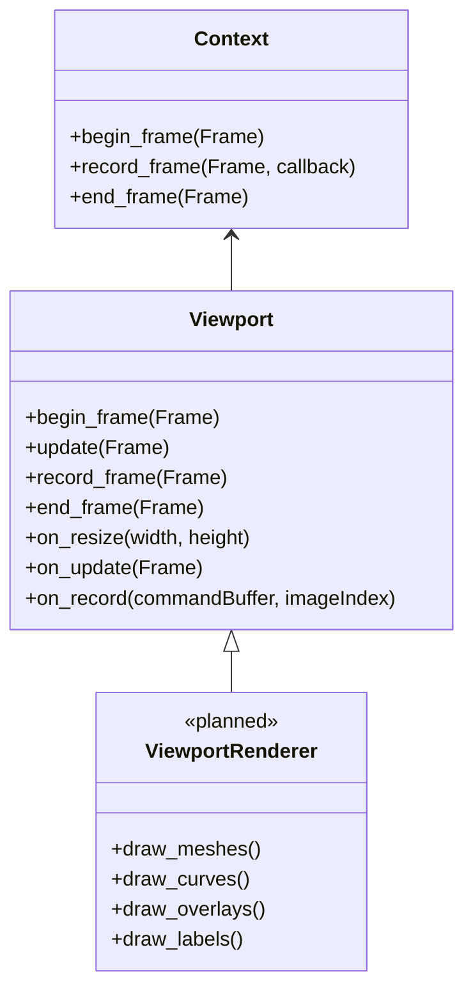

# VP Library Design Draft

## 1. Purpose

`vp` is the viewport toolkit built on top of `vkkk`.

`vkkk` remains the generic Vulkan wrapper: it owns Vulkan initialization, swapchain presentation, command buffers, pipelines, GPU resources, render targets, and the explicit frame lifecycle.

`vp` provides viewport-specific drawing and interaction utilities that library users commonly need when building an editor, DCC tool, CAD tool, scene viewer, or debug viewport:

- frame axis / orientation gizmo
- mesh drawing
- line, curve, and polyline drawing
- screen-space labels and annotations
- selection, hover, and click picking
- camera-oriented viewport helpers
- later: grid, transform gizmo, bounding boxes, outlines, and overlays

The intent is both to provide a useful toolkit to `vkkk` users and to serve as a maintained, real-world demonstration of how `vkkk` is used for multi-pass viewport rendering.

## 2. Scope and boundaries



### `vkkk` responsibilities

- Vulkan instance, device, queues, swapchain, synchronization, and presentation
- explicit `begin_frame` → `record_frame` → `end_frame` lifecycle
- pipeline creation, shader reflection, descriptor allocation, buffers, textures, render targets, and passes
- low-level draw, compute, and resource synchronization APIs

### `vp` responsibilities

- viewport render ordering and viewport-owned draw passes
- reusable pipeline/shader setup for common viewport elements
- CPU-side draw submission APIs and batching
- viewport interaction state: camera-facing overlay placement, hover state, selection identifiers
- translating viewport features into `vkkk::Context` calls

### Non-goals for the first versions

- replacing `vkkk::Context` or hiding all Vulkan concepts
- scene import, asset database, animation system, or document model
- a full UI framework; `vp` may integrate with ImGui but does not own application UI
- editor-specific undo/redo, hierarchy, inspector, or file serialization

## 3. Core object model

The current `vkkk::vp::Viewport` is a non-owning frame-lifecycle base class over an initialized `vkkk::Context`.



`Viewport` does not own the `Context`, GLFW window, scene model, or user data. Applications keep ownership and pass references or view-style data into `vp`.

Viewport utilities are composed from a compile-time `Viewport<Features...>` feature pack rather than a growing list of drawing methods on `Viewport`. Each declared feature type has a typed runtime store, so applications may add or remove instances during runtime without virtual dispatch. Lifecycle calls are expanded and dispatched directly at compile time. `Viewport` records scene features first, then records screen-overlay features in a load-preserving overlay pass.

```cpp
using EditorViewport = vkkk::vp::Viewport<vkkk::vp::FrameAxisFeature>;
EditorViewport viewport(ctx);
auto axis = viewport.add_feature<vkkk::vp::FrameAxisFeature>(camera);
viewport.remove_feature(axis);
```

Adding a new feature *type* requires declaring it in the `Viewport` template argument list; this is the deliberate tradeoff for static dispatch.

The preferred frame loop is:

```cpp
vkkk::Context::Frame frame;
if (!viewport.begin_frame(frame))
    return;

viewport.update(frame);
viewport.record_frame(frame);
viewport.end_frame(frame);
```

`on_update` prepares CPU-side batches and interaction state. `on_record` issues rendering work through `Context`.

## 4. Planned rendering phases

The initial viewport should keep its render sequence explicit rather than introduce a render graph.

1. **Scene depth pass** — optional depth-only pass for mesh visibility and picking.
2. **Scene color pass** — shaded, unlit, wireframe, or selection-highlighted meshes.
3. **World overlay pass** — grids, axes, curves, bounds, and 3D annotations, depth-tested or depth-biased as appropriate.
4. **Screen overlay pass** — frame axis, labels, selection rectangles, and UI-adjacent elements.
5. **Picking pass** — executed only when needed; renders object/element IDs to an integer or encoded color target, then reads the requested pixel.

The first milestone does not need all phases. Meshes, curves, and overlays may initially share the normal swapchain color/depth pass. Separate render targets should be added only where required by a feature such as picking or post-processing.

## 5. Feature modules

### 5.1 Frame axis / orientation gizmo

The frame axis is the small XYZ indicator shown in the reference image. It is a screen-corner overlay whose orientation follows the viewport camera but whose position and size are screen-space stable.

Responsibilities:

- draw X/Y/Z axes with consistent colors
- draw axis labels near the line endpoints
- support orthographic and perspective cameras
- reserve a screen rectangle for hit testing later
- remain visible independently of scene depth

Initial implementation: line geometry plus text labels, rendered after the scene with depth testing disabled.

### 5.2 Mesh drawing

`vp` should accept named meshes already uploaded to `Context` and later accept `MeshView` for user-owned geometry.

Planned modes:

- solid shaded
- unlit vertex color
- wireframe
- selected / hovered highlight
- depth-only
- object-ID output for picking

The module should batch submissions by pipeline and mesh where possible. It should not duplicate the asset ownership responsibilities of `DrawableMgr`.

### 5.3 Lines and curves

Curves are viewport primitives rather than imported mesh assets.

Initial supported data:

- line segments
- polylines
- per-vertex or per-curve color
- line width
- optional depth test

Later extensions:

- Bezier and NURBS tessellation
- dashed lines
- anti-aliased screen-space width
- curve control points and edit handles

The public API should accept user-owned point arrays through views/spans rather than require copies. GPU uploads and batching remain internal to `vp`.

### 5.4 Labels and annotations

Labels associate UTF-8 text with either a 3D world position or a 2D screen position.

Initial behavior:

- world labels are projected by the active camera
- labels outside the viewport or behind the camera are culled
- screen labels use pixel coordinates relative to the viewport extent
- a basic font atlas and glyph batching are owned by `vp`

Later behavior:

- background boxes, leader lines, alignment, overlap avoidance
- DPI scaling
- text picking

### 5.5 Picking and selection

Picking maps a screen pixel to a stable application-provided identifier.

The first design uses an on-demand ID pass:

1. The application submits pickable mesh/curve/gizmo elements with a `PickId`.
2. `vp` renders their IDs into a dedicated picking target using the same camera and depth rules as the visible pass.
3. A click requests one pixel from that target.
4. `vp` returns the `PickId` and optional hit metadata.

`vp` must not interpret the identifier. Applications own the mapping from `PickId` to their scene objects, components, or control points.

GPU readback and the storage/readback target API are not currently available in `vkkk`; this module should be introduced only after that wrapper support exists.

## 6. Common data types

These are intended API directions, not final declarations.

```cpp
namespace vkkk::vp {

using PickId = uint32_t;

struct Color {
    float r = 1.0f;
    float g = 1.0f;
    float b = 1.0f;
    float a = 1.0f;
};

struct MeshDraw {
    std::string_view mesh_name;
    glm::mat4 model{1.0f};
    Color color{};
    PickId pick_id = 0;
};

struct PolylineView {
    std::span<const glm::vec3> points;
    Color color{};
    float width = 1.0f;
    bool depth_test = true;
    PickId pick_id = 0;
};

struct Label {
    std::string_view text;
    glm::vec3 world_position{};
    Color color{};
};

} // namespace vkkk::vp
```

Public draw submissions should use views (`std::span`, `std::string_view`, and `MeshView`) when possible. `vp` consumes them during the frame update/record period; callers retain ownership and must keep submitted data alive until that frame has been recorded.

## 7. Coordinate conventions

- **World space:** application-defined, matching the active camera and mesh transforms.
- **View/projection space:** supplied by the camera used by the viewport.
- **Screen space:** pixels in the current `Viewport::extent()`, origin at the upper-left for UI-facing APIs.
- **NDC:** Vulkan depth range `[0, 1]`; viewport shaders and camera setup must preserve this convention.
- **Frame axis:** oriented by the inverse camera rotation and placed within a fixed screen-space corner rectangle.

The viewport API must document whether any primitive uses world units or pixels. Lines and labels will eventually support both explicitly.

## 8. Resource ownership and lifetime

- `Context` owns all Vulkan objects and frame synchronization.
- `Viewport` owns only viewport-specific CPU state and resources created through `Context`.
- Applications own scene data, cameras, meshes, curve points, and object identifiers.
- Viewport GPU resources must be released before `Context` is destroyed.
- On resize, `Viewport::on_resize` recreates only its swapchain-sized resources; fixed-size resources such as a future picking target may opt out of automatic matching.

## 9. Initial implementation order

1. **Viewport base** — complete; lifecycle hooks, resize observation, and composed feature registration.
2. **Viewport camera contract** — define the camera data required by all viewport modules.
3. **Frame axis** — in progress; three red/green/blue camera-oriented strokes in a screen overlay pass. Labels and arrow heads remain later work.
4. **Mesh submission** — draw a list of named meshes with transforms and simple selection colors.
5. **Polyline/curve batch** — world-space line and curve visualization.
6. **Label renderer** — font atlas, glyph batch, world/screen labels.
7. **Picking foundation** — add the missing `vkkk` image readback capability, then ID rendering and click queries.
8. **Editing helpers** — grids, bounds, outlines, transform gizmos, and control-point handles.

## 10. Open design questions

- Whether camera control belongs in `vp` or remains an application-owned input/controller layer.
- Whether labels should initially use ImGui fonts or a dedicated `vp` font atlas.
- Whether curves are tessellated on CPU first or generated by a mesh/compute shader path.
- The pick-ID encoding format and readback synchronization policy.
- Whether viewport modules are inheritance-based (`Viewport` subclasses) or composed as registered passes.

Until these are resolved, new viewport features should be implemented as focused modules that use the existing `Viewport` hooks and `Context` APIs rather than expanding `Context` with editor-specific behavior.
